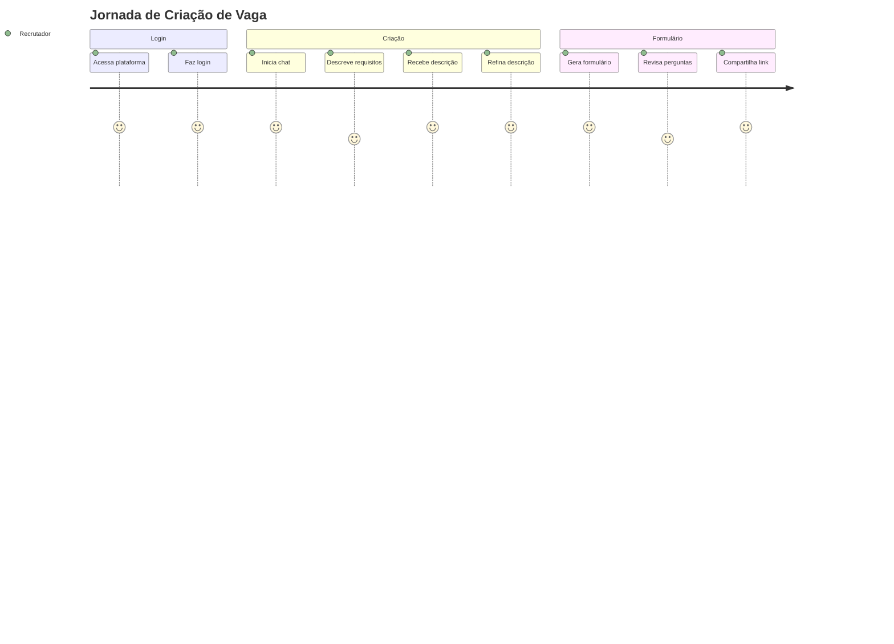
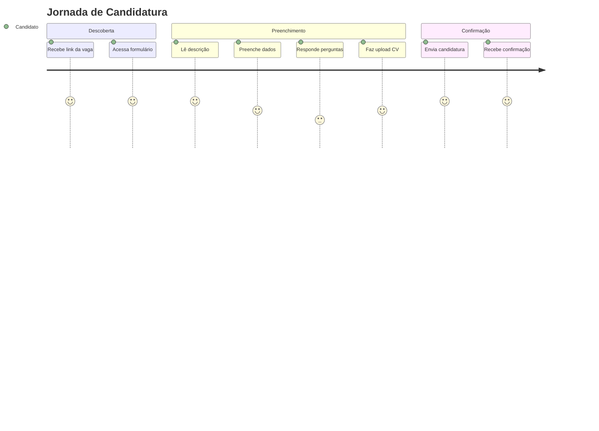

# Product Requirements Document (PRD) - RH Qualificador v4.1

## Sumário Executivo

### Visão do Produto
O RH Qualificador v4.1 é uma plataforma SaaS de recrutamento alimentada por IA que revoluciona o processo de contratação, automatizando a criação de descrições de vagas, geração de formulários de triagem personalizados e análise inteligente de candidatos.

### Problema
- Processos de recrutamento manuais e demorados
- Descrições de vagas inconsistentes e pouco atrativas
- Dificuldade em criar perguntas de triagem relevantes
- Análise subjetiva e inconsistente de candidatos
- Alto volume de candidaturas para processar manualmente

### Solução
Uma plataforma integrada que utiliza IA para:
1. Gerar descrições de vagas profissionais e atrativas
2. Criar formulários de candidatura personalizados automaticamente
3. Analisar candidatos de forma objetiva e consistente
4. Reduzir o tempo de triagem em até 80%

## Objetivos de Negócio

### Objetivos Primários
- **Reduzir tempo de contratação**: De 45 dias para 15 dias em média
- **Aumentar qualidade das contratações**: 40% menos turnover nos primeiros 6 meses
- **Escalar operações de RH**: Processar 10x mais candidatos com a mesma equipe
- **Padronizar processos**: 100% de aderência aos critérios de seleção

### KPIs de Sucesso
- Tempo médio de criação de vaga: < 5 minutos
- Taxa de conversão candidato/entrevista: > 15%
- NPS dos recrutadores: > 70
- Redução de custo por contratação: 30%

## Usuários e Personas

### 1. Recrutador/HR Manager (Persona Principal)
**Nome**: Maria Silva  
**Idade**: 32 anos  
**Cargo**: Gerente de Recrutamento  

**Necessidades**:
- Criar vagas rapidamente
- Receber candidatos qualificados
- Análises objetivas para tomada de decisão
- Dashboard centralizado

**Dores**:
- Perder tempo escrevendo descrições
- Avaliar centenas de CVs manualmente
- Falta de padronização nas avaliações
- Dificuldade em justificar decisões

### 2. Candidato (Persona Secundária)
**Nome**: João Santos  
**Idade**: 28 anos  
**Situação**: Em busca de nova oportunidade  

**Necessidades**:
- Processo de candidatura simples
- Feedback sobre sua aplicação
- Transparência no processo

**Dores**:
- Formulários longos e repetitivos
- Falta de feedback
- Processos demorados

### 3. Gestor/Hiring Manager
**Nome**: Carlos Oliveira  
**Idade**: 40 anos  
**Cargo**: Diretor de Tecnologia  

**Necessidades**:
- Candidatos pré-qualificados
- Processo rápido
- Relatórios de análise

**Dores**:
- Entrevistar candidatos não qualificados
- Processos demorados impactam projetos

## Requisitos Funcionais

### RF1: Geração de Descrição de Vagas

#### Descrição
Sistema de chat com IA para criar descrições profissionais de vagas.

#### Critérios de Aceitação
- [ ] Interface de chat intuitiva
- [ ] Respostas em menos de 5 segundos
- [ ] Suporte a refinamento iterativo
- [ ] Templates por área/senioridade
- [ ] Histórico de conversas salvo

#### User Stories
```
Como recrutador,
Quero descrever os requisitos da vaga em linguagem natural,
Para que a IA gere uma descrição profissional e atrativa.
```

### RF2: Geração Automática de Formulários

#### Descrição
Criação automática de formulários de triagem baseados na descrição da vaga.

#### Critérios de Aceitação
- [ ] Geração de 10-15 perguntas relevantes
- [ ] Perguntas técnicas e comportamentais
- [ ] Link único por formulário
- [ ] Personalização pós-geração

#### User Stories
```
Como recrutador,
Quero que o sistema gere perguntas de triagem automaticamente,
Para avaliar candidatos de forma consistente.
```

### RF3: Portal de Candidatura

#### Descrição
Interface para candidatos se aplicarem às vagas.

#### Critérios de Aceitação
- [ ] Formulário responsivo (mobile-first)
- [ ] Upload de currículo (PDF, DOC, DOCX)
- [ ] Validação de campos em tempo real
- [ ] Confirmação de envio por email
- [ ] Acessibilidade WCAG 2.1 AA

#### User Stories
```
Como candidato,
Quero me candidatar facilmente pelo celular,
Para não perder oportunidades por estar em trânsito.
```

### RF4: Dashboard de Gestão

#### Descrição
Central de controle para recrutadores gerenciarem vagas e candidatos.

#### Critérios de Aceitação
- [ ] Listagem de todas as vagas
- [ ] Visualização de candidatos por vaga
- [ ] Filtros e ordenação
- [ ] Exportação de dados (CSV/Excel)
- [ ] Métricas em tempo real

#### User Stories
```
Como recrutador,
Quero ver todos os candidatos em um só lugar,
Para gerenciar o pipeline de forma eficiente.
```

### RF5: Análise de Candidatos por IA

#### Descrição
Sistema de scoring e análise automática de candidatos.

#### Critérios de Aceitação
- [ ] Score geral de 0-100
- [ ] Scores por categoria (técnico, comportamental, cultural, experiência)
- [ ] Identificação de pontos fortes e fracos
- [ ] Recomendação de decisão (Contratar/Entrevistar/Rejeitar)
- [ ] Justificativa detalhada

#### User Stories
```
Como gestor,
Quero ver uma análise objetiva de cada candidato,
Para tomar decisões mais assertivas e rápidas.
```

### RF6: Sistema de Notificações

#### Descrição
Notificações para manter usuários informados.

#### Critérios de Aceitação
- [ ] Email de confirmação para candidatos
- [ ] Alertas de novas candidaturas
- [ ] Resumos diários/semanais
- [ ] Notificações in-app

## Requisitos Não Funcionais

### RNF1: Performance
- **Tempo de resposta**: < 2s para 95% das requisições
- **Uptime**: 99.9% de disponibilidade
- **Concorrência**: Suportar 1000 usuários simultâneos
- **Processamento**: Análise de candidato em < 30s

### RNF2: Segurança
- **Criptografia**: HTTPS obrigatório
- **Dados sensíveis**: Criptografia em repouso e trânsito
- **LGPD/GDPR**: Compliance total
- **Autenticação**: JWT com refresh tokens
- **Autorização**: RBAC (Role-Based Access Control)

### RNF3: Escalabilidade
- **Horizontal**: Auto-scaling baseado em carga
- **Vertical**: Suporte a upgrade sem downtime
- **Multi-tenant**: Isolamento por organização
- **Cache**: Redis para otimização

### RNF4: Usabilidade
- **Mobile-first**: 100% funcional em dispositivos móveis
- **Acessibilidade**: WCAG 2.1 nível AA
- **Internacionalização**: Suporte PT-BR e EN-US
- **Onboarding**: Tutorial interativo para novos usuários

### RNF5: Manutenibilidade
- **Cobertura de testes**: > 80%
- **Documentação**: API 100% documentada
- **Logs**: Estruturados e centralizados
- **Monitoramento**: Dashboards de observabilidade

## Jornadas do Usuário

### Jornada 1: Criação de Vaga (Recrutador)



### Jornada 2: Candidatura (Candidato)



## Roadmap do Produto

### MVP (v4.1) - Current
- ✅ Chat para geração de vagas
- ✅ Geração automática de formulários
- ✅ Portal de candidatura
- ✅ Dashboard básico
- ✅ Armazenamento de CVs

### v4.2 - Q1 2025
- [ ] Análise de candidatos por IA
- [ ] Sistema de scoring
- [ ] Filtros avançados
- [ ] Exportação de relatórios

### v4.3 - Q2 2025
- [ ] Integração com ATS externos
- [ ] API pública
- [ ] Templates de vagas
- [ ] Workflow de aprovação

### v5.0 - Q3 2025
- [ ] Video screening
- [ ] Agendamento de entrevistas
- [ ] Portal do candidato
- [ ] Analytics avançado

## Integrações

### Integrações Atuais
1. **Supabase**
   - Banco de dados PostgreSQL
   - Autenticação
   - Storage de arquivos
   - Realtime updates

2. **N8N Webhooks**
   - Processamento de chat
   - Geração de formulários
   - Análise de candidatos

### Integrações Futuras
- LinkedIn (importação de perfil)
- Google Calendar (agendamento)
- Slack/Teams (notificações)
- Gupy/Workday (sincronização)
- WhatsApp Business (comunicação)

## Modelo de Negócio

### Planos de Assinatura

#### Starter - R$ 299/mês
- 10 vagas ativas
- 100 candidatos/mês
- Suporte por email
- Relatórios básicos

#### Professional - R$ 899/mês
- 50 vagas ativas
- 1000 candidatos/mês
- Suporte prioritário
- API access
- Relatórios avançados

#### Enterprise - Sob consulta
- Vagas ilimitadas
- Candidatos ilimitados
- SLA garantido
- Customizações
- Treinamento incluído

### Métricas de Sucesso

#### Métricas de Produto
- MAU (Monthly Active Users): > 10.000
- Retenção 6 meses: > 80%
- Vagas criadas/mês: > 50.000
- Candidatos processados/mês: > 500.000

#### Métricas de Negócio
- MRR (Monthly Recurring Revenue): R$ 500.000
- CAC (Customer Acquisition Cost): < R$ 500
- LTV (Lifetime Value): > R$ 10.000
- Churn mensal: < 5%

## Riscos e Mitigações

### Riscos Técnicos
| Risco | Probabilidade | Impacto | Mitigação |
|-------|--------------|---------|-----------|
| Downtime da IA | Média | Alto | Fallback para templates |
| Limite de API | Baixa | Médio | Rate limiting e cache |
| Vazamento de dados | Baixa | Muito Alto | Auditorias e pen tests |

### Riscos de Negócio
| Risco | Probabilidade | Impacto | Mitigação |
|-------|--------------|---------|-----------|
| Baixa adoção | Média | Alto | Onboarding e treinamento |
| Concorrência | Alta | Médio | Diferenciação por IA |
| Regulamentação | Média | Alto | Compliance proativo |

## Considerações Legais e Compliance

### LGPD/GDPR
- Consentimento explícito para processamento
- Direito ao esquecimento implementado
- Portabilidade de dados
- DPO (Data Protection Officer) designado

### Diversidade e Inclusão
- Linguagem neutra nas descrições
- Remoção de viés algorítmico
- Métricas de diversidade
- Acessibilidade total

## Glossário

- **ATS**: Applicant Tracking System
- **CAC**: Customer Acquisition Cost
- **LTV**: Lifetime Value
- **MAU**: Monthly Active Users
- **MRR**: Monthly Recurring Revenue
- **NPS**: Net Promoter Score
- **RBAC**: Role-Based Access Control
- **SLA**: Service Level Agreement
- **WCAG**: Web Content Accessibility Guidelines

## Anexos

### A. Mockups e Wireframes
[Link para Figma com designs]

### B. Pesquisa de Mercado
[Documento com análise competitiva]

### C. Feedback de Usuários
[Resultados de entrevistas e surveys]

---

**Versão**: 4.1.0  
**Data**: Dezembro 2024  
**Autor**: Equipe de Produto - Agência Lendária  
**Status**: Em Desenvolvimento  
**Próxima Revisão**: Janeiro 2025