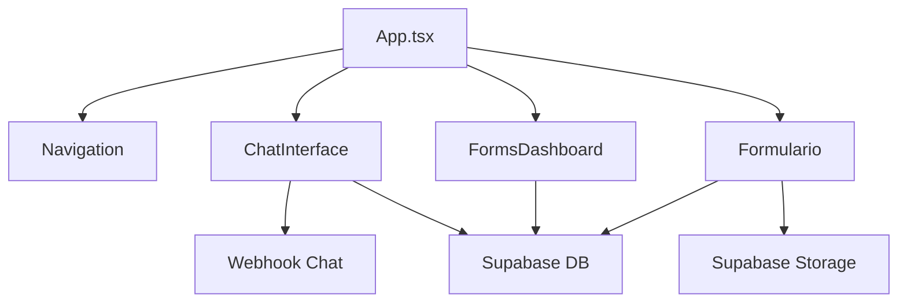
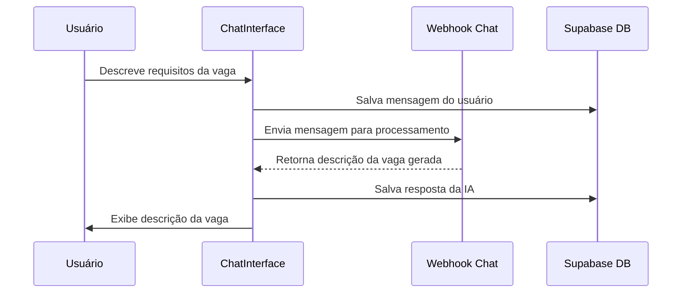
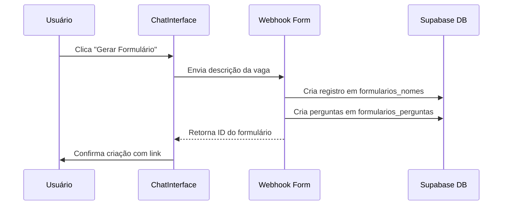
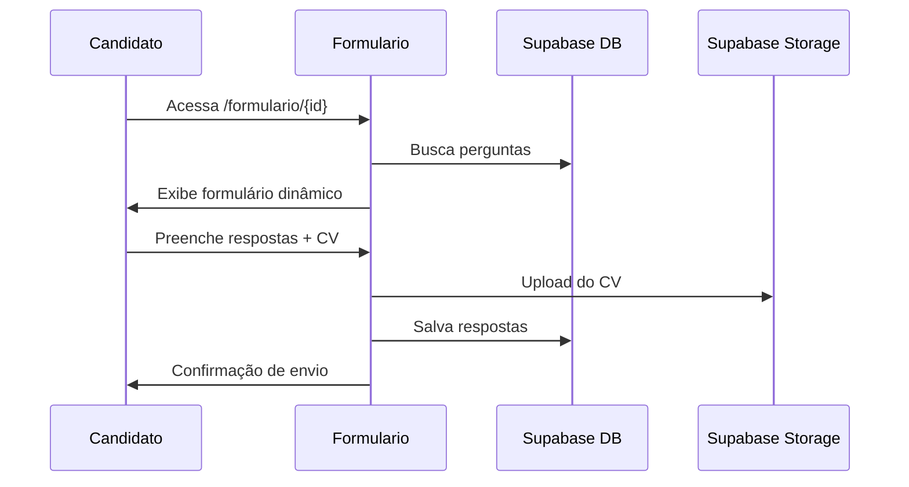

# Documentação Técnica - RH Qualificador v4.1

## Sumário
1. [Visão Geral](#visão-geral)
2. [Instalação e Configuração](#instalação-e-configuração)
3. [Arquitetura do Sistema](#arquitetura-do-sistema)
4. [Banco de Dados](#banco-de-dados)
5. [Integrações Externas](#integrações-externas)
6. [APIs e Webhooks](#apis-e-webhooks)
7. [Fluxos do Sistema](#fluxos-do-sistema)
8. [Estrutura de Pastas](#estrutura-de-pastas)
9. [Segurança](#segurança)

## Visão Geral

O **RH Qualificador v4.1** é uma plataforma de recrutamento baseada em IA que automatiza a criação de descrições de vagas, formulários dinâmicos de candidatura e análise de candidatos.

### Stack Tecnológica
- **Frontend**: React 18.3.1 + TypeScript 5.5.3
- **Estilização**: Tailwind CSS 3.4.1 + Radix UI
- **Build Tool**: Vite 5.4.2
- **Backend**: Supabase (PostgreSQL + Auth + Storage)
- **Integrações**: Webhooks N8N para processamento IA
- **Forms**: React Hook Form + Zod validation
- **Roteamento**: React Router DOM 7.6.3

## Instalação e Configuração

### Pré-requisitos
- Node.js 18+ 
- npm ou yarn
- Conta no Supabase
- Acesso aos webhooks do N8N

### Instalação

```bash
# Clone o repositório
git clone [url-do-repositório]

# Entre no diretório
cd rh-qualificador-v4.1

# Instale as dependências
npm install

# Configure as variáveis de ambiente
cp .env.example .env
```

### Variáveis de Ambiente

Crie um arquivo `.env` na raiz do projeto com as seguintes variáveis:

```env
# Supabase
VITE_SUPABASE_URL=https://seu-projeto.supabase.co
VITE_SUPABASE_ANON_KEY=sua-chave-anonima

# Webhooks N8N
VITE_WEBHOOK_CHAT_URL=https://n8nwebhook-ops.agencialendaria.ai/webhook/[chat-webhook-id]
VITE_WEBHOOK_FORM_GENERATOR_URL=https://n8nwebhook-ops.agencialendaria.ai/webhook/[form-webhook-id]
```

### Comandos de Desenvolvimento

```bash
# Iniciar servidor de desenvolvimento (porta 5173)
npm run dev

# Build para produção
npm run build

# Preview do build de produção
npm run preview

# Executar linter
npm run lint

# Executar testes
npm run test
```

## Arquitetura do Sistema

### Componentes Principais



### Descrição dos Componentes

1. **App.tsx** (`src/App.tsx`)
   - Componente raiz
   - Gerencia estado global do chat
   - Configuração de rotas
   - Gerenciamento de sessão

2. **ChatInterface** (`src/components/ChatInterface.tsx`)
   - Interface de chat com IA
   - Geração de descrições de vagas
   - Integração com webhook de chat
   - Persistência de mensagens

3. **FormsDashboard** (`src/components/FormsDashboard.tsx`)
   - Dashboard de gerenciamento de formulários
   - Listagem de formulários criados
   - Análise de candidatos

4. **Formulario** (`src/components/Formulario.tsx`)
   - Formulário dinâmico de candidatura
   - Upload de currículo
   - Validação de campos

## Banco de Dados

### Configuração Supabase

Conexão configurada em `src/lib/supabase.ts`:

```typescript
import { createClient } from '@supabase/supabase-js';
import { env } from '../config/env';

export const supabase = createClient(env.SUPABASE_URL, env.SUPABASE_ANON_KEY);
```

### Estrutura das Tabelas

#### 1. `formularios_nomes`
Armazena metadados dos formulários criados.

| Campo | Tipo | Descrição |
|-------|------|-----------|
| id | integer | PK, auto-incremento |
| vaga_do_form | text | Título da vaga |

#### 2. `formularios_perguntas`
Armazena as perguntas dinâmicas de cada formulário.

| Campo | Tipo | Descrição |
|-------|------|-----------|
| id | integer | PK, relacionado com formularios_nomes.id |
| q1 | text | Pergunta 1 (obrigatória) |
| q2-q15 | text | Perguntas 2-15 (opcionais) |

#### 3. `formularios_respostas`
Armazena as respostas dos candidatos.

| Campo | Tipo | Descrição |
|-------|------|-----------|
| id | integer | PK, auto-incremento |
| response_id | text | ID único da resposta |
| user_name | text | Nome do candidato |
| user_email | text | Email do candidato |
| a1-a15 | text | Respostas 1-15 |
| cv_bucket_link | text | Link do CV no storage |

#### 4. `formularios_chat_histories`
Histórico de conversas do chat.

| Campo | Tipo | Descrição |
|-------|------|-----------|
| id | integer | PK, auto-incremento |
| session_id | text | ID da sessão de chat |
| message | jsonb | {sender, text, timestamp} |
| created_at | timestamp | Data de criação |

#### 5. `formularios_candidate_analysis`
Análise de IA dos candidatos.

| Campo | Tipo | Descrição |
|-------|------|-----------|
| id | integer | PK, auto-incremento |
| response_id | text | FK para formularios_respostas |
| job_title | text | Título da vaga |
| overall_score | integer | Pontuação geral (0-100) |
| technical_score | integer | Pontuação técnica |
| behavioral_score | integer | Pontuação comportamental |
| cultural_fit_score | integer | Pontuação de fit cultural |
| experience_score | integer | Pontuação de experiência |
| strengths | text[] | Array de pontos fortes |
| concerns | text[] | Array de preocupações |
| red_flags | text[] | Array de red flags |
| decision | enum | HIRE, NO_HIRE, INTERVIEW |
| reasoning | text | Justificativa da decisão |
| next_steps | text[] | Próximos passos recomendados |
| development_areas | text[] | Áreas de desenvolvimento |
| confidence_level | enum | HIGH, MEDIUM, LOW |
| full_analysis_json | jsonb | Análise completa em JSON |
| created_at | timestamp | Data de criação |
| updated_at | timestamp | Data de atualização |

### Storage Buckets

- **CVs Storage**: Armazenamento de currículos em PDF
  - Path: `/cv_uploads/{response_id}/{filename}`
  - Tamanho máximo: 10MB
  - Formatos aceitos: PDF, DOC, DOCX

## Integrações Externas

### 1. Webhook de Chat
**URL**: Configurado em `VITE_WEBHOOK_CHAT_URL`

**Função**: Processar mensagens do usuário e gerar descrições de vagas usando IA.

**Request (POST)**:
```json
{
  "message": "string - mensagem do usuário",
  "timestamp": "ISO 8601 string",
  "sender": "user",
  "session_id": "chat_{timestamp}_{random}"
}
```

**Response**:
```json
{
  "message": "string - resposta da IA com descrição da vaga",
  "timestamp": "ISO 8601 string",
  "sender": "assistant"
}
```

### 2. Webhook de Geração de Formulário
**URL**: Configurado em `VITE_WEBHOOK_FORM_GENERATOR_URL`

**Função**: Gerar perguntas personalizadas baseadas na descrição da vaga.

**Request (POST)**:
```json
{
  "jobDescription": "string - descrição completa da vaga",
  "session_id": "chat_{timestamp}_{random}"
}
```

**Response**:
```json
{
  "formId": "integer - ID do formulário criado",
  "questions": {
    "q1": "string - pergunta 1",
    "q2": "string - pergunta 2",
    // ... até q15
  },
  "jobTitle": "string - título da vaga"
}
```

## Fluxos do Sistema

### 1. Fluxo de Geração de Vaga



### 2. Fluxo de Criação de Formulário



### 3. Fluxo de Candidatura



## Estrutura de Pastas

```
rh-qualificador-v4.1/
├── src/
│   ├── components/
│   │   ├── ui/              # Componentes base do design system
│   │   ├── ChatInterface.tsx
│   │   ├── FormsDashboard.tsx
│   │   ├── Formulario.tsx
│   │   ├── Navigation.tsx
│   │   └── MeetingsAnalysis.tsx
│   ├── config/
│   │   └── env.ts           # Validação de variáveis de ambiente
│   ├── lib/
│   │   ├── supabase.ts      # Cliente e tipos do Supabase
│   │   └── utils.ts         # Funções utilitárias
│   ├── styles/
│   │   └── globals.css      # Estilos globais e Tailwind
│   ├── App.tsx              # Componente principal
│   └── main.tsx             # Entry point
├── public/
│   └── favicon.ico
├── docs/
│   ├── TECHNICAL_DOC.md     # Esta documentação
│   └── PRD.md               # Product Requirements Document
├── changelog/               # Logs de mudanças
├── CLAUDE.md               # Instruções para IA
├── DESIGN_SYSTEM.md        # Documentação do design system
└── package.json
```

## Segurança

### Boas Práticas Implementadas

1. **Variáveis de Ambiente**
   - Credenciais sensíveis em `.env` (não versionado)
   - Validação obrigatória na inicialização

2. **Supabase RLS (Row Level Security)**
   - Políticas de acesso configuradas no banco
   - Autenticação via JWT tokens

3. **Validação de Entrada**
   - Zod schemas para validação de formulários
   - Sanitização de inputs do usuário

4. **Upload de Arquivos**
   - Validação de tipo MIME
   - Limite de tamanho (10MB)
   - Storage isolado por response_id

### Pontos de Atenção

1. **CORS**: Configurar adequadamente nos webhooks
2. **Rate Limiting**: Implementar nos endpoints críticos
3. **Logs**: Não expor informações sensíveis
4. **XSS**: React já sanitiza por padrão, mas cuidado com dangerouslySetInnerHTML

## Monitoramento e Debugging

### Logs do Sistema
- Console logs para debug em desenvolvimento
- Supabase logs para queries e erros de banco

### Ferramentas Recomendadas
- React DevTools para debug de componentes
- Network tab para monitorar requisições
- Supabase Dashboard para monitorar banco e storage

## Próximos Passos

1. Implementar testes automatizados
2. Adicionar CI/CD pipeline
3. Implementar cache para otimização
4. Adicionar métricas de performance
5. Documentar APIs REST próprias